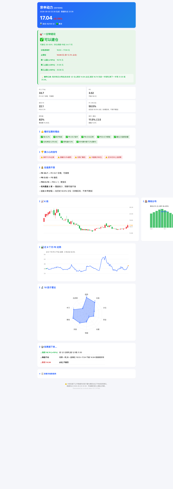

# a-stock-quant-analyzer

把公开 A 股数据源（腾讯、同花顺、baostock、东财）封装成一个 10 因子 / 100 分的量化打分引擎。
跑 `python quant_analyzer_v2.py 001696 宗申动力` 会得到一份 HTML 报告，里面有进场价、止损位、三档止盈，以及 K 线、筹码、PE 历史、10 因子雷达图。

数据从公开接口直拉，不依赖任何付费 API（除 iwencai 语义搜索需自备 Key）。报告是单文件 HTML，离线能看，能直接发微信。

## 报告长啥样



完整可交互版（带图表、雷达图、三种情景表）：[examples/sample-001696-zongshen.html](https://swartea.github.io/a-stock-quant-analyzer/examples/sample-001696-zongshen.html)

## 安装

```bash
git clone https://github.com/Swartea/a-stock-quant-analyzer.git
cd a-stock-quant-analyzer
pip install -r requirements.txt
```

需要 Python 3.9+。

## 使用

```bash
python quant_analyzer_v2.py 001696 宗申动力
```

输出写到 `./reports/YYYY-MM-DD/`，每个代码两个文件（Markdown + HTML）。要换输出目录：

```bash
export A_STOCK_OUT_DIR=/path/to/reports
python quant_analyzer_v2.py 001696 宗申动力
```

批量分析改脚本末尾的 `analyze_batch([...])`。

## 10 因子（100 分）

| 因子 | 满分 | 数据源 |
|------|------|---------|
| 趋势 | 12 | 腾讯实时 |
| 估值 | 15 | 腾讯 + 同花顺一致预期 |
| 估值分位 | 8 | baostock 3 年历史 PE/PB |
| 资金 | 15 | 东财 push2 当日分钟级 |
| 动量 | 8 | 腾讯实时 |
| 情绪 | 8 | 同花顺北向 + 强势股 |
| 风险 | 10 | 腾讯 + 东财解禁 |
| 筹码 | 8 | baostock 前复权 K 线 + 本地算法 |
| 申万稳定 | 6 | 申万行业分类 XLS |
| 龙虎榜 | 10 | 东财龙虎榜近 30 日 |

打分逻辑在 `quant_analyzer_v2.py::compute_quant_score_v2`，每条加/减分都有 `factors.append(...)` 记录。

## 数据源与限制

| 源 | 用途 | 限制 |
|----|------|------|
| 腾讯 `qt.gtimg.cn` | 实时价/PE/PB/换手 | 不封 IP |
| 同花顺 `basic.10jqka.com.cn` | 一致预期 EPS / 北向 / 强势股 | 需 UA + Referer，偶发风控 |
| baostock (TCP) | 估值历史 / 筹码 K 线 | 国内 IP 稳定；**不支持北交所**（4/8/92/920 号段） |
| 东财 `push2.eastmoney.com` | 概念板块 / 资金流 / 解禁 / 龙虎榜 | 内置串行限流（≥1.2s）+ 会话复用；部分大陆住宅 IP 间歇风控（HTTP 000/空），换网络或手机热点可解 |
| 申万 XLS | 行业分类变迁 | HTTPS 证书需 `pip install -U certifi` |

## 哪些情况不适合用

- **需要盘中秒级 tick 数据**——本工具最低粒度是分钟级资金流
- **要选 ETF / 可转债 / 期货 / 美股 / 港股** —— 目前只覆盖 A 股个股
- **要自动化盯盘 / 推送** —— 这只是个分析器，没定时任务、没推送通道
- **要回测策略** —— 工具出的是当前快照 + 历史分位，不是回测引擎
- **你没有 Python 基础** —— 本工具是 CLI + 代码调用，不是有 GUI 的应用

## 已知问题

- 北交所股票（4/8/92/920 号段）：腾讯价能拿到，但 baostock 估值历史/筹码拿不到，会优雅降级
- 海外网络：mootdx / 东财经常连不上，腾讯/同花顺通常 OK
- 部分接口会变：东财 URL 参数、Referer 头等可能在某次改版后失效，遇到 `HTTP 000` 或空响应先看是不是网络问题再排查代码

## 数据源出处

- [腾讯财经](https://stockapp.finance.qq.com)
- [同花顺](https://www.10jqka.com.cn)
- [baostock](http://baostock.com)
- [东方财富](https://eastmoney.com)
- [申万研究](https://www.swsresearch.com)
- [国家统计局](http://www.stats.gov.cn)
- [中国人民银行](http://www.pbc.gov.cn)

## License

MIT

## 免责声明

本项目仅做数据获取和量化展示，**不构成任何投资建议**。股市有风险，投资需谨慎。
